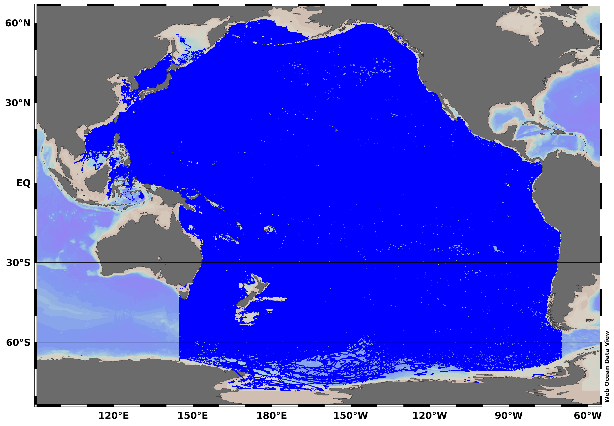

# webodv-cross-server-integration
Step-by-step tutorial on webODV's cross-server integration function.

In this example we show how to use webODV's cross-server integration -
the ability to pull in data from multiple servers and overlay them in
a unified visual and analytical framework.

 
*HOT (station ALOHA, white dot on map) oxygen data between 480 - 520 dbar
are shown as blue dots with an overlaid black moving average
line. Individual BGC Argo oxygen data (red dots on map) for the same
interval retrieved via webODV’s cross-server integration have been
overlaid (red dots plus gray moving average line). The combination of
ship-based Niskin measurements with autonomous float observations
demonstrates how webODV facilitates direct comparison of complementary
datasets without preprocessing or downloading.*

# Open the BGC Argo dataset

In your webbrowser visit https://argo-webodv.vm.fedcloud.eu, and choose
*Ocean->Biogeochemistry->BGC-Argo Global Profiles*, or directly
https://argo-webodv.vm.fedcloud.eu/public/ocean/biogeochemistry/bgc-argo_global_profiles.
On the
next page click on *WEBODV EXPLORE*.  
Choose *View->Load View->public->AllStationsMap*.  Consider to save your work regularly via right
click on the canvas (white area) and select *Save View As*. Note that the view is saved in your
Browsers cache. To have a real back up, download the view via *View->Manage Resources->Views*, click
on the respective view and on *Download*.

 

## Domain

Right click into the map and choose *Properties*, or use the keyboard shortcut *ALT+P*. On the dialog select
*Domain* and enter *West=197*, *East=207*, *North=25*, *South=18* and
click on *Apply*.

## Filter Stations

Again, right click into the map and choose *Station
Filter->Customize* (*ALT+S*). On the dialog select Domain and enter *West=200*, *East=204*, *North=24*, *South=22*.
Then, on the dialog, select *Availability* and click on *8. Dissolved Oxygen (adjusted) [umol kg-1]*
and click on *Apply*. Right click on the black text on the map and click on *Delete Object* to remove the text.
To jump directly into this intermediate state, download this *.xview* file:
[webodv_xservint_filter_stations.xview](./xviews/webodv_xservint_filter_stations.xview).
Then in webODV go to *View->Manage Resources->Views->Click to select a view for upload* and choose the *.xview* file from your computer.

 

## Create Scatter Window and Derived Variables

Right click into the white area next to the map (the *canvas*). On the dialog choose *Layout->Layout
Templates->1 SCATTER WINDOW*, or click on the *+* in the top menu bar and choose the *1 SCATTER
WINDOW*. Next choose *View->Derived Variables* (*ALT+D*), on the dialog open the *Time* node
and select *Time (station date/time)*. Click *Apply*.  
Right click into the Scatter Window, on the dialog select *X-Variable* (or *X* on the keyboard)
and choose *drvd: Time (station date/time)*. Repeat for *Y-Variable*
and choose *8. Dissolved Oxygen (adjusted) [umol kg-1]*.
Use this *.xview* to access the plot immediately: [webodv_xservint_scatter.xview](./xviews/webodv_xservint_scatter.xview).

 

## Filter Depth and Outliers

Right click into the Scatter Window choose *Sample Filter->Customize* (*SHIFT+S*). On the dialog select
*Range*. As Variable choose *2. Pressure (adjusted) [decibar]* and fill the Acceptable Range from
*480* to *520*. Then select *Quality*, variable *8. Dissolved Oxygen (adjusted) [umol kg-1]* and
choose as Accepted Quality Flag *1: good data*.  Click *Apply*.

## Full Range, Color and Zoom

Right click into the Scatter Window and choose *Full Range->All*.
Right click into the Scatter Window and open the *Properties*. Goto
*Display Style* click into the *Symbol color* box and choose red color
number *12*. Change the *Symbol size to 12*. Click *Apply*.  Right
click into the Scatter Window again and choose *Zoom*. Move the right
*Zoom rectangle* a bit to the left to remove the gap between data
points and window frame.

Right click into the map
choose *Properties->Display Style* and select color *12* as well.
Respective view file: [webodv_xservint_filter.xview](./xviews/webodv_xservint_filter.xview).

 

## Apply moving average filter

Right click into the scatter window, select *Statistics->Curve Fitting*. On the pop up window select
*Type->Moving Average*, *Number of grid goints: 30* and *Averaging length scale: 300*. Then click on
*Construct Curve* and on *Show Curve*. Close the pop up. Right click on the just created moving
average line and select *Properties*. Choose *Line->thick* and color *22*. Click on *Apply*.
Respective view file: [webodv_xservint_mv.xview](./xviews/webodv_xservint_mv.xview).

 

# HOT

Keep the webODV Argo view open in the Browser tab. Open a new Browser tab and
go to https://hot.webodv.awi.de, choose the *Discrete Water Column* dataset, and click on *WEBODV
EXPLORE* on the next page, or click directly on
https://hot.webodv.awi.de/public/discrete_water_column/discrete_water_column.
Choose *View->Load View->public->Default*. 

## Filter stations

Right click on the map, choose *Station Filter->Customize* (*ALT-S*). Click on *Date/Time* select *Period*
from *Jan 01 1990* to *Dec 31 99999*. Click on *Meta Data*, under *Text Meta Variables* choose
*Site* and type *ALOHA* into the text field. Then click on *Availability* and select *9. Bottle
Dissolved Oxygen*. Click on *Apply*.
Respective view file: [webodv_xservint_hot_filter.xview](./xviews/webodv_xservint_hot_filter.xview).

 

## Scatter plot

Similar to above we create a scatter plot.
Right click into the white area next to the map (the *canvas*). On the
dialog choose *Layout->Layout Templates->1 SCATTER WINDOW* (or click on the *+* in the top menu bar). Next 
choose *View->Derived Variables* (*ALT+D*), on the dialog open the *Time* node
and select *Time (station date/time)*. Click *Apply*.  
Right click into the Scatter Window, on the dialog select *X-Variable* (*X* on the keyboardx)
and choose *drvd: Time (station date/time)*. Repeat for *Y-Variable*
and choose *9. Bottle Dissolved Oxygen [umol/kg]*.
Respective view file: [webodv_xservint_hot_scatter.xview](./xviews/webodv_xservint_hot_scatter.xview).

 

## Filter data

Right click into the scatter plot. Choose *Sample Filter->Customize* (*SHIFT+S*). On the pop up,
select *Range*. Under *Variable* choose *2: CTD Pressure* and type into *Acceptable Range*
*480-520*.  Then select *Quality*, variable *9. Bottle Dissolved Oxygen [umol/kg]* and choose as
Accepted Quality Flag *0: good data*. Click on *Apply*. Right click and select *Properties* (*ALT+P*). Click
on *Display Style* and change *Symbol size* to *12* and *Symbol color* to *1*. Click *Apply*.
Respective view file:
[webodv_xservint_hot_filter_data.xview](./xviews/webodv_xservint_hot_filter_data.xview).

 

## Apply moving average filter

Right click into the scatter window, select *Statistics->Curve Fitting*. On the pop up window select
*Type->Moving Average*, *Number of grid goints: 30* and *Averaging length scale: 300*. Then click on
*Construct Curve* and on *Show Curve*. Close the pop up. Right click on the just created moving
average line and select *Properties*. Choose *Line->thick* and color *0*. Click on *Apply*.
Respective view file: [webodv_xservint_hot_mv.xview](./xviews/webodv_xservint_hot_mv.xview).

 

## Copy graphics objects

Go back to the Argo webODV and open the last view [webodv_xservint_mv.xview](./xviews/webodv_xservint_mv.xview).
Right click into the scatter window. Select *Extras->Export as Graphics Object->Sample Dots->to
Clipboard*. A success dialog appears, click on *Close*. 

Go back into the latest HOT view, right click into the scatter window and select *Layout->Add
Graphics Object->from Clipboard*. The Argo data appears. Right click on the Argo data to open the
object *Properties*. Choose *Fill color: 12* and *Border color: 12*. Click on Apply. Then right click on
the HOT moving average line, select *Move to Foreground*.

Now we go back to the Argo view to copy the moving average line. Right click on the moving average
line and select *Export Object->to Clipboard*. Back in HOT, right click into the free area in the
scatter window and select *Layout->Add Graphics Object->from Clipboard*.

Again in the Argo webODV, right click into the map and select *Extras->Export as Graphics
Object->Station Dots->to Clipboard*. Go back to HOT, right click into the map and choose
*Layout->Add Graphics Object->from Clipboard*.

Now we need a trick to make the HOT station data visible. Right click into the map and select
*Extras->Export as Graphics Object->Station Dots->to Clipboard*. Again right click into the map and
choose *Layout->Add Graphics Object->from Clipboard* to copy a graphics object of the data into the
map. Right click on HOT object data and choose *Fill color: 1*, *Border color: 1* and *Size: 12*.

Finally right click into the map and choose *Properties* (*ALT+P*). On the dialog select
*Domain* and enter *West=197*, *East=207*, *North=25*, *South=18* and
click on *Apply*.
Respective view file: [webodv_xservint_hot_go.xview](./xviews/webodv_xservint_hot_go.xview).

 

## Change Layout

We are in the HOT view. Right click into the scatter window, select *Set Ranges* (*ALT+R*) and set *Bottle
Dissolved Oxygen* to *0-200*. Click on Apply. Right click again and select *Layout->Move / Resize Window* (*CTRL+R*).
A red border appears around the scatter window where you can drag the edges to change the Layout.
Do the same with the map and place the map inside the scatter window. 
Respective view file: [webodv_xservint_hot_layout.xview](./xviews/webodv_xservint_hot_layout.xview).

 

## Legend

We want to create a legend in the HOT view. Right click into the free area of the scatter
plot. Choose *Layout->Add Graphics Object->Symbol*. The cursor changes to a cross. Click into the
upper right area of the plot to add a symbol. On the dialog choose *Fill color: 1* and *Border
color: 1* and *Size: 40*. Click on *Apply*. Right click on the blue dot. Open *Properties*. Set
*Position X:2014, Y:190*. Click on Apply. Do it again, now for a red (color 12) dot and place the
red dot at *Position X:2014, Y:180*.

Next create a short line via a same procedure *Add Graphics Object*. Make the line *thick* and place
it via drag and drop below the dot symbols. Use color *22*. Then copy the line via right click *Copy
Object*. Place the new line below the existing line via drag and drop. Choose color *0*. 

We have now the needed symbols.
Respective view file: [webodv_xservint_hot_legend_symbols.xview](./xviews/webodv_xservint_hot_legend_symbols.xview).

 

Now we need the respective texts. Again we use *Add Graphics Object* to add *Annotations*. The first
word *HOT* should be placed at *Position X:2016, Y:190* with *Alignment X: left, Y: center*. Text
size is *14*. The next word *BGC-Argo* should be placed at *Position X:2016, Y:180* with *Alignment
X: left, Y: center*.  The next words should be placed similarly with *Y:170* and *Y:160*. Maybe the line positions have to be
adjusted by drag and drop.  Finally we add a rectangle via *Add Graphics Object*. It appears in the
center of the plot and can be moved and scaled. We move it over our legend as a box. As *Fill color*
we choose white *15* and line *thin medium*. Then right click on the black rectangle line and select *Move to Background*.
Respective view file: [webodv_xservint_final.xview](./xviews/webodv_xservint_final.xview).

 

