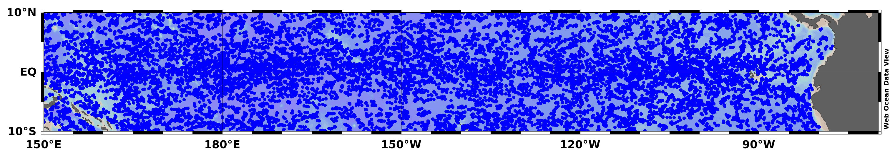
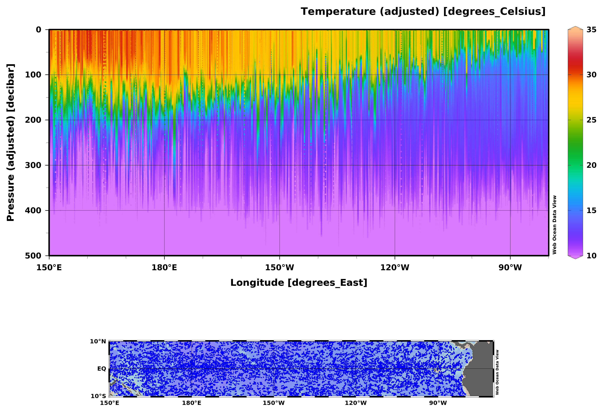
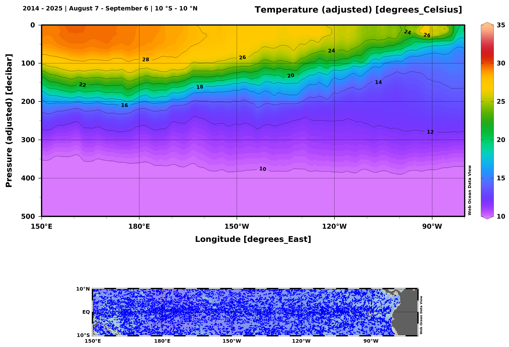
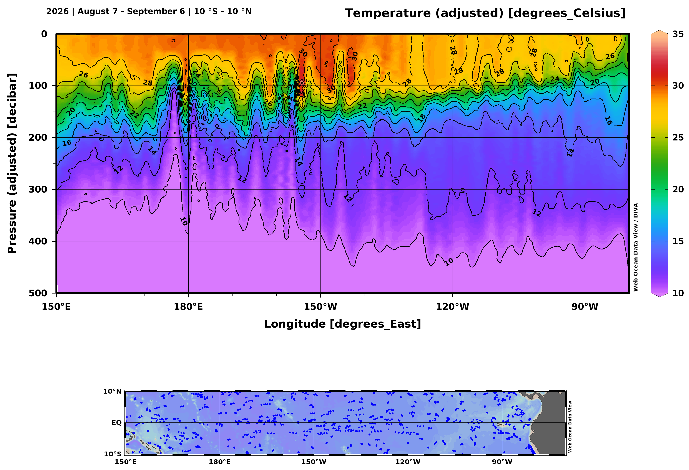
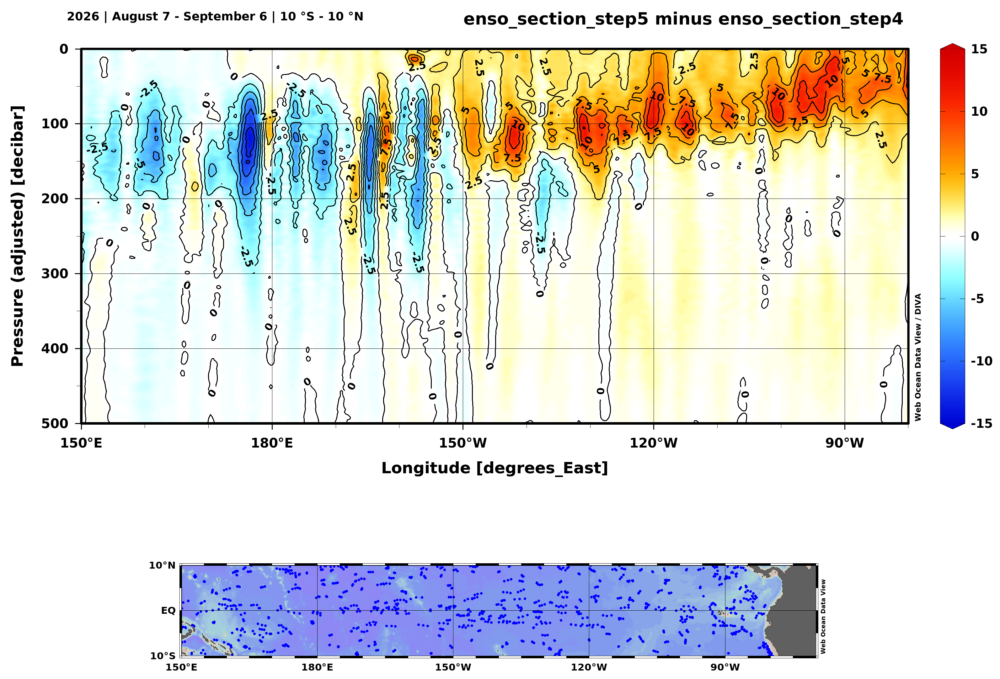

# webodv-enso
Step-by-step tutorial on webODV's ENSO monitoring.

In this example we show how to use webODV's data exchange functionality -
the ability to store reference data and apply it to current data.

# Open the Pacific Argo dataset

In your webbrowser visit https://argo-webodv.vm.fedcloud.eu, and choose
*Ocean->Hydrography->Argo_Pacific_Profiles*, or directly
https://argo-webodv.vm.fedcloud.eu/public/ocean/hydrography/pacific_ocean/argo_pacific_profiles.
On the
next page click on *WEBODV EXPLORE*.  
Choose *View->Load View->public->AllStationsMap*.  Consider to save your work regularly via right
click on the canvas (white area) and select *Save View As*. Note that the view is saved in your
Browsers cache. To have a real back up, download the view via *View->Manage Resources->Views*, click
on the respective view and on *Download*.

 

## Domain

Right click into the map and choose *Properties*, or use the keyboard shortcut *ALT+P*. On the dialog select
*Domain* and enter *West=150*, *East=290*, *North=10*, *South=-10* and
click on *Apply*.

## Filter Stations by Period and Season

Again, right click into the map and choose *Station Filter->Customize* (*ALT+S*). On the tab Date /
Time choose From: *Jan 01 2014*; To: *Dec 31 2015*. Then choose Season From: *Aug 07*; To *Sep 06*. Click
Apply. What we did is selecting data from 2014 to 2025 only during the 30 day window August 7 and
September 6.

 
Use this *xview* to access the plot immediately: [enso_section_step2.xview](./xviews/enso_section_step2.xview).

## Create Scatter Window and Derived Variables

Right click into the white area next to the map (the *canvas*). On the dialog choose *Layout->Layout
Templates->1 SCATTER WINDOW*, or click on the *+* in the top menu bar and choose the *1 SCATTER
WINDOW*. Next choose *View->Derived Variables* (*ALT+D*), on the dialog select under Metadata,
Longitude. The new derived variable appears in the left dialog box. Click Apply. Now the *drvd:
Longitude* appears in the data variables list on the right.  Right click into the Scatter Window, on
the dialog select *X-Variable* (or *X* on the keyboard) and choose *drvd: Longitude*. Repeat for
*Y-Variable* and choose *2: Pressure (adjusted) [decibar]*, check the *Reverse range* tick box.  As
*Z-Variable* select *4: Temperature (adjusted) [degrees_Celsius]*.  Then right click into the
scatter window select *Sample Filter->Reject Outliers*. Then open the sample filter by right
clicking *Sample Filter->Customize* (*SHIFT+S*). Select the *Range* tab, Variable: *2: Pressure
(adjusted) [decibar]* and Acceptible Range *0* to *500*. Click on apply. Thus we select data in the
ocean interior between the surface and 500 dbar (ca. 500 m) depth. Further right click into the plot
and select *Set Ranges* (*ALT+R*). On the dialog choose Minimum: 10; Maximum: 35, for Temperature,
Longitude from 150 to 280 and Pressure from 0 to 500.  Click Apply. Change the layout by right click
into the scatter window *Layout->Move / Resize Window* (*CTRL-R*). A red border appears around the
plot and you can move and resize the plot using the mouse and drag and drop. Move and resize the map
as you wish.

 
*xview*: [enso_section_step3.xview](./xviews/enso_section_step3.xview).

## Gridding and contouring

Open the *Properties* of the scatter window. On the *Display Style* tab click on the *Gridded field*
radio button. From the dropdown menu, choose *DIVA gridding*, deselect the *Automatic scale length*
and *Draw marks* (left) checkboxes. Enter *20* for the *X scale length* and *Y scale length*. Select
the *Contours* tab. Enter *10* Start, *2* Increment and *35* End. Click on the << Symbol. Click on
Apply.  Right click into the white area (canvas), select *Layout->Add Graphics Object->Annotation*
(*CTRL-A*). A crosshair appears, left click into the white area to place an annotation. On the
dialog enter *2014 - 2025 | August 7 - September 6 | 10 °S - 10 °N*, leave the Font size at *12*. Click Apply. Move
the annotation with the left mouse click.

 
*xview*: [enso_section_step4.xview](./xviews/enso_section_step4.xview).

## Store data

Now we have created what we name the seasonally matched reference data. Right click into the plot,
select *Extras->Export Window Data->to Clipboard* or *...->to File*. On the dialog click *Start
Export*. Now the reference data are saved in the "clipboard" or in a file.

## Filter current 

We continue with the view and filter now the current surface conditions. Open the station filter on
the map.  (*ALT-S*) and select as Period From: *Jan 01 2026*; To: *Dec 31 2026*. Make sure that the
Season is still From: *Aug 07*; To *Sep 06*. Verify under properties that DIVA gridding with X and Y
scale length 20 is active. Right click on the title annotation and select Properties. Change the
title to *2026 | August 7 - September 6 | 10 °S - 10 °N*.

 
*xview*: [enso_section_step5.xview](./xviews/enso_section_step5.xview).

## Create anomaly

Right click into the scatter window and choose *Extras->Load Reference Data->from Clipboard* or
*from File* depending how you saved the data before. Then on the *Reference Data* dialog, select as
Operation: *Difference: base data minus reference data* and enter a Title and View Name or use the
default values. Click Apply. Open the Properties, select the *Color Mapping* tab and click on
*Linear Mapping*. Select the *Contours* tab, remove contours by holding *SHIFT* and selecting the
contour values. Then click the *>>* Button. Choose *-15* Start, *2.5* Increment, *15* End.
Click on Apply. Open the *Set Ranges* (*ALT+R*) and set the Temperature range from -15 to
15.

 
*xview*: [enso_section_step6.xview](./xviews/enso_section_step6.xview).
